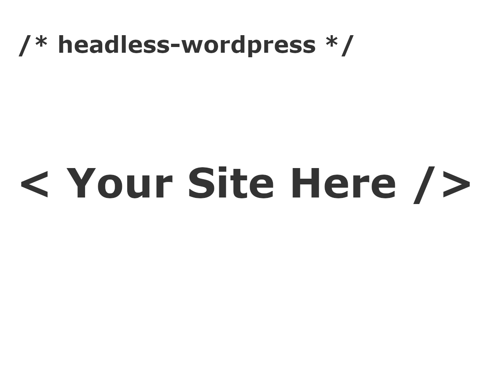

# wordpress-headless-index

This is just a useful index to drop into your headless themes



## How-to

Change the following lines of code to fit your admin location and site location

```php
<?php
	$site_location='#';
	$admin_location='/wp-admin'
?>
```
